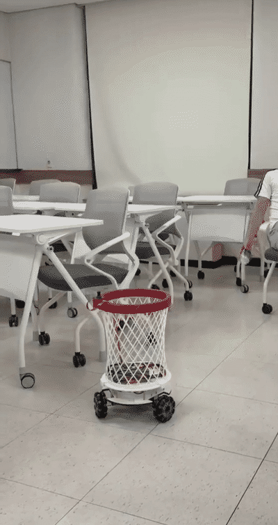

# Moving Trash Bin

**A three-wheeled omnidirectional robot that catches thrown objects by
predicting where they will land — using a single upward-facing camera.**

<p align="center">
  
</p>

한국어 문서는 [`README.ko.md`](README.ko.md)를 보세요.

---

## The idea

One photograph cannot tell you how far away something is. A small object
nearby and a large object far away produce exactly the same pixels. Most
robots solve this with a second camera, a depth sensor, or a known object
size.

This one uses **gravity as a ruler.**

Gravity is 9.8 m/s² regardless of what the object is. So instead of asking
"how far away is it?", the system asks:

> *For this sequence of pixel positions to have been produced by a constant
> 9.8 m/s² acceleration, how far away must the object have been?*

That question has one answer. The scale falls out of the physics, and the
object's size, mass and shape never enter the calculation. A can, a bottle
and a crumpled ball are handled identically, and the object may tumble
freely in flight — only the centre of its bounding box is used.

Concretely it is a **2N×6 linear least-squares solve**: six unknowns
(position and velocity at t₀), two equations per observation. No iteration,
no initial guess, no convergence failure. The trick is writing the pinhole
projection as a cross-product residual instead of a division, which removes
the nonlinearity:

```
u = fx·X/Z + cx          →    a·Z(t) − fx·X(t) = 0        where a = u − cx
```

Gravity enters as the inhomogeneous term — and that is precisely what makes
the solution unique rather than a family of solutions differing by scale.

Full derivation: [`docs/design/algorithm.md`](docs/design/algorithm.md) · Physics: [`docs/design/physics.md`](docs/design/physics.md)

---

## Status — and the honest result

**It works end to end, and it catches about half of what lands within roughly
40 cm of it. Outside that radius it catches nothing.**

| | |
|---|---|
| Catch rate inside the reachable region | **~50%** (n = 10) |
| Catch rate outside it | **0%** |
| Reachable radius in the time available | **~40 cm** |

The bottleneck is the **drive, not the vision.** We tested five candidate
causes and eliminated four:

| Candidate | Verdict |
|---|---|
| Trajectory estimation | ❌ Not it — fits synthetic throws to 0.0000 cm |
| YOLO detection | ❌ Not it — 60 fps, correct throughout flight |
| Pi ↔ Pico communication | ❌ Not it — 50 Hz, at the design ceiling |
| **Motor performance** | ✅ **This is it** |
| Direction-dependent failures | ❌ A consequence of the above |

The catch window is about **0.56 s** after detection and prediction, and
reachable distance grows as T² because the robot is still accelerating when
the object lands — it never reaches top speed. Acceleration is limited by
floor traction (4.9 N per wheel) rather than by the motors (35 N per wheel),
so a more powerful motor would not have helped either.

**The project set out to ask whether more training data would improve
catching. For this robot the answer is no** — perception was already
delivering correct detections at 60 fps, and every failure was downstream of
it. That is a useful negative result, and it is why no further dataset
collection was done.

Full analysis, with the elimination evidence for each candidate:
**[docs/guide/results.md](docs/guide/results.md)**.

This was a student project at [HY-LABA](https://github.com/HY-LABA), Hanyang
University. It is published because the approach — and the reasoning behind
every constant — may be useful to others, not because it is a finished
product.

---

## How it works

```
                  ┌──────────── Raspberry Pi 5 (60 fps) ───────────┐
   [camera] ──────▶  vision      YOLO → bounding-box centre         │
   facing up      │              + fisheye undistortion             │
                  │     ↓                                           │
                  │  tracker     one hypothesis per detection,      │
                  │              physics gates decide which is real │
                  │     ↓                                           │
                  │  trajectory  gravity-constrained least squares  │
                  │              → 3D path → landing point + time   │
                  │     ↓                                           │
                  │  control     landing point → world-frame target │
                  └───────────────────┬────────────────────────────┘
                                      │ USB CDC
             target + time remaining  ▼   ▲  odometry
                  ┌───────────────────┴────────────────────────────┐
                  │        Raspberry Pi Pico (50 Hz)                │
                  │  encoders (PIO) → forward kinematics → pose     │
                  │  remaining distance ÷ remaining time → speed    │
                  │  → inverse kinematics → PID → PWM               │
                  └───────────────────┬────────────────────────────┘
                                      ▼
                            3 × motor / omni wheel
```

**The Pi decides where and by when. The Pico works out how fast and drives
the wheels.** The Pico never learns what a trajectory is — it receives one
coordinate and one duration.

Three design decisions are worth knowing about:

- **Every detection gets its own hypothesis.** YOLO sometimes scores a
  ceiling light higher than the real object. Rather than picking the most
  confident detection, the system tracks all of them and lets the physics
  decide: a stationary false positive cannot produce a parabola, so its
  reprojection residual explodes and it is rejected.

- **The robot starts moving after 3 frames**, before the depth is known.
  Bearing is accurate immediately even when range is not — an upward-facing
  camera maps screen position directly to azimuth. So the robot accelerates
  in the right direction while the estimate converges. Waiting for a full
  fit means the object has already passed overhead.

- **Losing sight of the object does not stop the robot.** A thrown object is
  ballistic; not seeing it does not change where it is going. And it almost
  always leaves the frame just before landing, which is exactly when the
  robot most needs to be moving.

---

## Hardware

Roughly **KRW 930,000 (~USD 700)** for a complete build; about half of that
is the Pi 5 and the AI accelerator.

- **[Bill of materials](docs/guide/bom.md)** — every part, with specs and rationale
- **[Wiring diagram](docs/images/wiring-diagram.png)**
- **[Hardware notes](docs/design/hardware.md)** — power design, mounting conventions

Three things that will cost you a rebuild if you get them wrong:

1. **The camera must be global shutter.** A rolling shutter exposes rows at
   different instants, which silently violates the "one timestamp per frame"
   assumption the fit is built on.
2. **Encoder VCC must be 3.3 V, not 5 V.** They run happily at 5 V and will
   destroy the Pico's GPIO while appearing to work fine.
3. **All three motors must be identical.** Mismatched motors make the robot
   curve under load, and it is very hard to diagnose after assembly.

---

## Getting started

```bash
git clone https://github.com/HY-LABA/LABA6_toyproject.git
cd LABA6_toyproject
```

See **[docs/guide/getting-started.md](docs/guide/getting-started.md)** for the full path:
dependencies → firmware flash → camera calibration → direction check →
first run.

The order matters. In particular, **verify the drive direction before you
connect the camera** — with the camera in the loop, a wiring sign error and a
camera mounting error look identical, and you can spend a long time chasing
the wrong one. (We did.)

```bash
# Drive only. No camera, no YOLO.
python src/pi5/pico_test.py --port /dev/ttyACM0 --dir front --dist 0.5 --speed 0.3

# Prediction only. Robot stationary — measures the estimator in isolation.
python src/pi5/test_accuracy.py

# Everything.
python src/pi5/main.py
```

---

## Repository layout

```
src/                        all code
  pi5/                      Raspberry Pi 5 — Python
    main.py                 frame loop: capture → detect → track → command
    trajectory.py           the least-squares solver. Pure functions, no state
    tracker.py              all the state: hypotheses, physics gates, commitment
    vision.py               Picamera2 + Hailo YOLO + undistortion
    control.py              landing point → world target; direction-aware speed limits
    communication.py        USB serial framing
    config.py               every tunable constant, each with its justification
    prep/                   dataset collection, labelling and training tools
  pico/                     Raspberry Pi Pico — C (Pico SDK). Flash the .uf2
  pico_micropython/         the same firmware in MicroPython, for tuning without reflashing

docs/                       all documentation
  guide/                    start here (English): BOM, getting started, results
  design/                   design rationale (Korean): "why this number"
  images/                   wiring diagram, demo
  archive/                  superseded documents, kept for history
```

---

## Documentation

The reference documentation is **in Korean** — about 4,400 lines of it,
including the reasoning behind essentially every constant in the codebase.
The English documents are listed first.

| Document | Language | Contents |
|---|---|---|
**`docs/guide/` — start here (English)**

| Document | Contents |
|---|---|
| [bom.md](docs/guide/bom.md) | Bill of materials, substitutions |
| [getting-started.md](docs/guide/getting-started.md) | Setup, calibration, first run |
| [results.md](docs/guide/results.md) | What was measured, and what was not |

**`docs/design/` — why every number is what it is (Korean)**

| Document | Contents |
|---|---|
| [algorithm.md](docs/design/algorithm.md) | The estimator, the control loop, parameters |
| [architecture.md](docs/design/architecture.md) | File-by-file responsibilities, data flow |
| [physics.md](docs/design/physics.md) | Motion model, friction, catch radius, optics |
| [hardware.md](docs/design/hardware.md) | Parts, power, mounting conventions |
| [pico-control.md](docs/design/pico-control.md) | Real-time loop, kinematics, odometry, PID |
| [protocol.md](docs/design/protocol.md) | The Pi ↔ Pico wire contract |
| [vision-pipeline.md](docs/design/vision-pipeline.md) | Dataset, labelling, training, Hailo compilation |
| [open-questions.md](docs/design/open-questions.md) | Unresolved risks, honestly listed |

And [CHANGELOG.md](CHANGELOG.md) (Korean) — every design change and why it happened.

If you read one document, read [`docs/design/algorithm.md`](docs/design/algorithm.md). If you read
two, add [`docs/design/open-questions.md`](docs/design/open-questions.md) — it is the list
of things we know are wrong.

---

## Results

### How far it can actually go

Reachable distance against the time available, where T is flight time minus
perception and prediction delay. The two columns are the best and worst
directions — the velocity envelope of a three-wheel omni is a hexagon, so
reach varies about 15% with direction.

| T | Distance passed | With a full stop |
|---|---|---|
| 0.30 s | 8–9 cm | 5 cm |
| **0.45 s** | **18–21 cm** | 10–12 cm |
| **0.60 s** | **32–38 cm** | 18–21 cm |
| 0.80 s | 55–65 cm | 33–38 cm |
| 1.00 s | 80–93 cm | 51–59 cm |

Measured time available after detection and prediction: **0.56 s on average.**
That is the ~40 cm figure, and it is the whole ballgame.

Note the shape: **going from 0.45 s to 0.60 s nearly doubles the reach.**
In this regime distance grows as T², so latency is worth far more than motor
power. Cutting 0.15 s from the pipeline would buy more than any plausible
motor upgrade.

### Where the estimator stands

Synthetic throws, median landing error by detection noise and observation
count:

| Noise | n=10 | n=20 | n=30 | n=35 |
|---|---|---|---|---|
| 0 px | 0.0000 cm at every count tested | | | |
| 0.5 px | 87.4 cm | 8.3 cm | 2.6 cm | **1.4 cm** |
| 1.0 px | 156.2 cm | 33.4 cm | 7.7 cm | **3.8 cm** |
| 2.0 px | 194.8 cm | 86.3 cm | 32.2 cm | **16.4 cm** |

With clean input the solver is exact. What it needs is **observations** — at
60 fps, n=30 is half a second of flight. The real system gets 0.4–0.5 s,
which is just barely enough.

This is why detection quality matters even though detection is not the
bottleneck: earlier detection means more observations, and more observations
move you left-to-right across that table very quickly.

Full elimination evidence for each candidate cause:
[`docs/guide/results.md`](docs/guide/results.md).

---

## Known limitations

Listed because they are more useful to you than a clean README would be.
Full list in [`docs/design/open-questions.md`](docs/design/open-questions.md).

- **Wheel speed limit is unmeasured.** `WHEEL_MAX_SPEED_MPS` is set above
  what the motors actually deliver. When the robot moves sideways, one wheel
  must turn twice as fast as the other two, saturates alone, and the robot
  curves instead of translating. Moving forward is unaffected, because there
  the two active wheels saturate together and the ratio is preserved.

- **Drive direction is corrected in software.** The wheels currently run
  inverted relative to the firmware's convention, compensated by
  `DRIVE_INVERT` on the Pi side rather than fixed in firmware. The root cause
  has not been found.

- **Heading drifts.** The Pico integrates θ from encoders with no reference
  and never resets it. Wheel slip or spurious rotation accumulates, and θ is
  used to rotate incoming commands — so the error feeds back into steering.

- **Camera tilt is not compensated.** The estimator assumes the optical axis
  is exactly vertical. Ours is off by ~3.9°, worth roughly 4 cm of landing
  error.

- **Detection fails against ceiling lights.** When the object visually
  overlaps a light fixture it is not detected for those frames. This happens
  early in flight, when the object is high — which is exactly when losing
  frames hurts most, since it delays the start of the observation window.

- **Most throws are simply out of reach.** With a ~40 cm radius, anything
  thrown further away cannot be caught regardless of how well the rest of the
  system performs. Any evaluation of this robot has to separate "missed
  because perception failed" from "missed because no robot could have made
  it" — otherwise the second category swamps the first and nothing is
  measurable.

---

## License

- **Code** — [MIT](LICENSE)
- **Documentation and diagrams** — [CC BY 4.0](https://creativecommons.org/licenses/by/4.0/)

This project involves lithium polymer batteries, 40 A motor drivers and
moving machinery. It is provided with no warranty of any kind. Build and
operate at your own risk.

## Citation

See [`CITATION.cff`](CITATION.cff), or:

> Choi, J., Jang, I., et al. *Moving Trash Bin: a catching robot using
> gravity-constrained monocular trajectory estimation.* HY-LABA, Hanyang
> University, 2026. https://github.com/HY-LABA/LABA6_toyproject

## Acknowledgements

Built by the LABA 6th cohort at Hanyang University, advised by Prof. 나현종.
